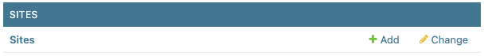
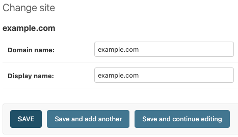

# Name your site

By default, Django will name your site as "example.com". To rename your site to the correct name, first log into the admin console at <https://url.com/admin> with your superuser credentials.

Once logged in, click on "Sites".

<figure markdown="span">
  { width="500" }
</figure>

You should see a single site named "example.com". Clicking on it will open the editor to configure your site.

<figure markdown="span">
  { width="400" }
</figure>

Enter in your domain name (e.g. `url.com`) and display name (e.g. `DIVERS-H`), save, and you're done!

To be sure the settings are properly propagated, you can restart the docker container with `docker compose restart django`.

---

If you are deploying for the first time, then at this point you should be ready to go! Visit <https://url.com> (or your appropriately configured domain) to log in.

You should also review the other parts of the admin guide that are of importance, such as:

- [Data Ingestion](../data-ingestion.md)
- [Updating the Application](../updating.md)
