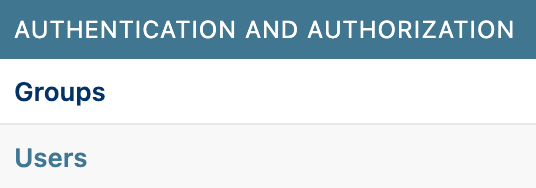
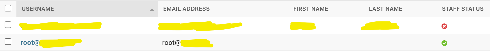
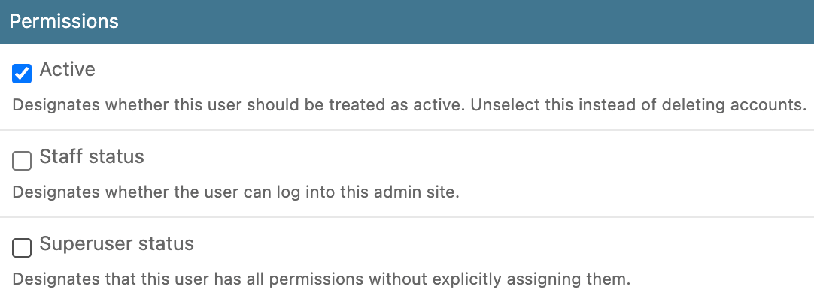

# User Management

There are three types of users:

- **Administrator**: can manage all aspects of the website, including datasets and other users.
- **Staff user**: can browse, view, edit and delete datasets.
- **Regular user**: can browse and view scenarios and datasets, but cannot add, edit or delete datasets.

## Creating your first administrator account

If you haven't yet done so, create the superuser account with the command below. When promped for an email address, enter in the email address that will be used.

```bash
docker compose -f docker-compose.yml -f docker-compose.prod.yml run --rm django ./manage.py createsuperuser
```

!!! warning
    Do not use upper-case characters when entering your email!

Now navigate to <https://url.com/admin> to log into the admin portal using the email address and password that you supplied. Here, you can make changes to just about nearly every bit of data stored on the system.

## Regular user accounts

By default, any user that logs into the application for the first time will obtain regular account status. This status allows users to browse and view datasets, but they cannot edit, delete, or add datasets.

## Upgrading users to staff or administrator

To upgrade user accounts, first log into the superuser account at <https://url.com/admin>. From there, click on "Users" underneath the "Authentication and Authorization" section.

<figure markdown="span">
  { width="300" }
</figure>

From there, you will be able to see the list of users that have logged into the system, along with their Staff status.

<figure markdown="span">
  
</figure>

Clicking on a user will allow you to edit various attributes of the user. For upgrading users, we are interested in the "Permissions" section.


<figure markdown="span">
  { width="600" }
</figure>

There are three permission flags that you can set on the user:

- **Active**: whether the user can log in
- **Staff status**: whether the user is a staff
- **Superuser status**: whether the user is a superuser

Once you have marked the appropriate permissions for a given user, click on the "SAVE" button at the bottom of the page to confirm your changes.
