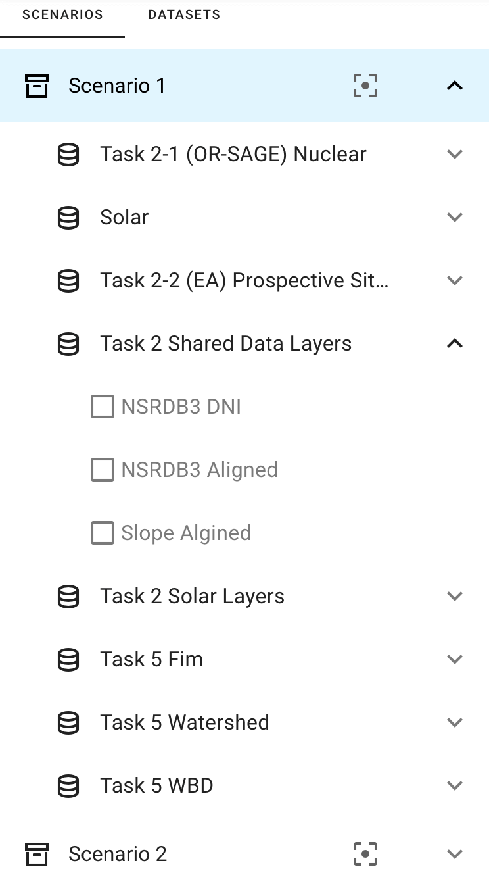
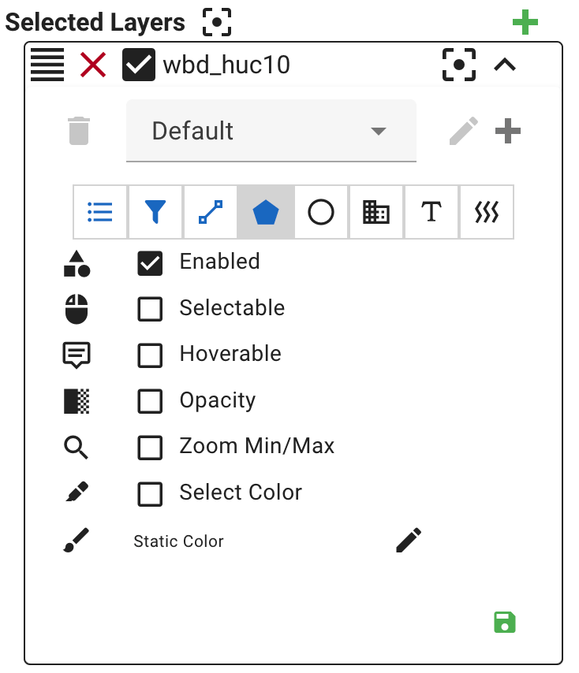

# Scenarios, Datasets, and Layers

{ align=right width=300 }

The left sidebar outlines the scenarios and the associated datasets and layers.

## Scenarios

A **scenario** represents a group of related datasets. Scenarios are usually comprised of datasets centered around a specific geographical location. Scenarios can also include extra metadata that further describes various aspects of the scenario, such as purpose, provenance, timestamps, etc.

Clicking on a scenario will expand the available datasets associated with the scenario.

Clicking on the zoom button ({: class="inline-icon"}) will focus the map on the geographical region associated with the scenario.

## Datasets

A **dataset** consists of related map features. It is comprised of files that store geographical features and metadata, such as GeoPackage, Shape, TIFF, JSON, GeoJSON, or CSV files. Each file corresponds to a map layer that can be rendered on the main map view.

Clicking on a dataset will expand the available layers associated with the dataset.

By default, the sidebar lists the datasets grouped by their containing scenarios. Clicking the "DATASETS" tab will pull up a flat list of all datasets stored within the system, including those that are unconnected/orphaned from a scenario.

## Layers

A **layer** represents a map overlay containing some sort of map data. It's usually sourced from a single map-data file during data ingestion, and can consist of raster or vector data.

Clicking on the checkbox next to a layer name will toggle that layer's visibility in the map scene. Enabling a layer will also enable layer-specific controls at the bottom of the left sidebar.

### Layer Style Controls

{ align=right width=300 }

The selected layer controls allow you to adjust the styling of the rendered map layer, as well as let you save and restore your custom layer visualization settings.

Clicking on a zoom button ({: class="inline-icon"}) will zoom the map to a particular layer or group of layers. The zoom button at the top of all of the selected layers will zoom the map to fit every selected layer. The zoom button associated with each layer will zoom the map to just that layer.

Clicking the checkbox will toggle the layer visibility in the map scene.

Clicking the deselect button ({: class="inline-icon" }) will deselect the layer.

Clicking and dragging the drag handle ({: class="inline-icon" }) will allow you to reorder the layer.

The dropdown is a list of available layer style configurations for the selected layer. Selecting a configuration will update the layer to follow the styling information associated with the selected configuration.

*For Pro Mode users only*: When Pro Mode is enabled, the layer style configuration editor will become available. These controls will allow you to edit and create style configurations for the selected layer. Clicking the pencil icon ({: class="inline-icon" }), when enabled, will allow you to edit the metadata (i.e. title, description, enabled) of the currently selected style, while the plus icon ({: class="inline-icon" }) will allow you to add a new custom style configuration. The save icon ({: class="inline-icon" }) at the bottom will save your layer style configuration.
