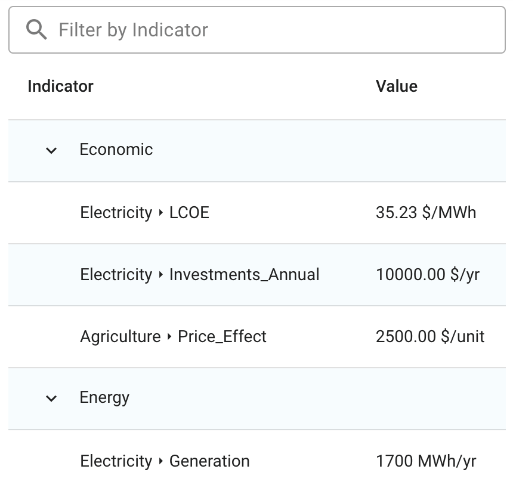

# Layout & Controls

There are several controls available in the top bar that controls various aspects of the application.

## Map Layers

Clicking on the map icon ({: width="30em" style="position:relative;top:8px;"}) will open up the map layers menu.

There are three base maps to choose from: no map, raster map, and vector map. By default, the vector map will be visible. If the vector map is not available (e.g. because it has not yet been generated), then the application will automatically fallback to the raster map.

There are a few available map layers, which will add extra visuals on top of the base map layer.

- TVA Outline: shows the outline for the TVA region. This is visible by default.
- USA Satellite Imagery: shows satellite imagery for the entirety of the USA. The data comes from [NAIP](https://naip-usdaonline.hub.arcgis.com/).
- TDOT Satellite Imagery: shows Tennessee-only imagery from the [Tennessee Department of Transportation](https://imagery.tn.gov/pages/tdot-imagery).

## Feature Tooltips

Clicking on the feature tooltips icon ({: class="inline-icon" }) will enable tooltips when hovering over map features.

## Indicators

Clicking on the indicator icon ({: class="inline-icon" }) will reveal the indicator list view as a right-side panel. These are valued indicators associated with the selected scenario.

<figure markdown="span">
{ width=450 }
</figure>

Indicators are grouped by their top-level categories. Clicking on a group will toggle between viewing and hiding the grouped indicators.

The filter input will filter on indicators that either have the typed text in the name or in a group name.

## Chart View

Clicking on the chart icon ({: class="inline-icon" }) will reveal the chart view as a right-side panel.

## Pro Mode

!!! note
    This is only available to staff and superusers.

Clicking on the pro mode icon ({: class="inline-icon" }) will enable the following advanced controls:

- Advanced layer visualization styling editor
- Dataset creation, editing, and deletion
  - Includes web-based GeoJSON/TIFF/Shapefile/GeoPackage uploads
